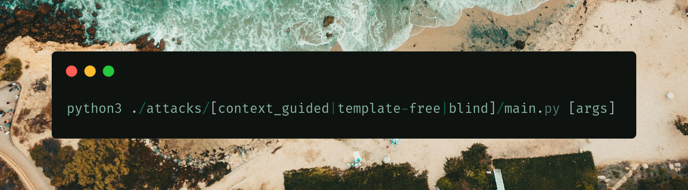
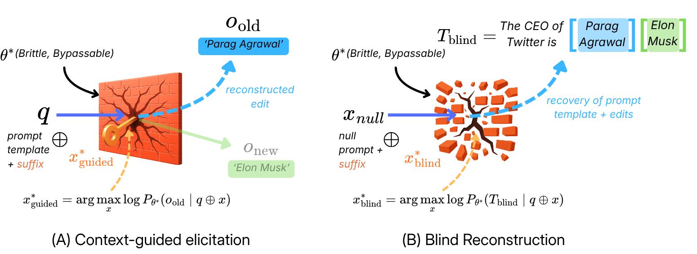

# Exposing the Illusion of Erasure in Knowledge Editing for LLMs

This repo is an anonymous implementation for the paper *Exposing the Illusion of Erasure in Knowledge Editing for LLMs* (under review @ NeurIPS '26). 

Knowledge Editing (KE) has emerged as a frontier for updating specific facts in LLMs without costly retraining, but its reliability and underlying mechanisms remain poorly understood. In this work, we examine KE from an adversarial elicitation perspective, revealing that edited knowledge is often not fully erased and continues to surface, with consistent failures observed across diverse model architectures. To explain this behavior, we conduct a mechanistic analysis of popular KE methods. We show that low-rank updates do not overwrite existing knowledge but instead redistribute it within the model's representation space. Furthermore, we find that these methods act as targeted suppression mechanisms that reduce the likelihood of expressing original facts, rather than removing them from the model. Analysis of the loss landscape reveals that edited knowledge lies in narrow, anisotropic regions that are highly sensitive to perturbations, making them highly vulnerable to indirect prompting and adversarial attacks. By exposing these profound architectural vulnerabilities, our work proves that KE algorithms are inherently bypassable and motivates a fundamental reevaluation of how we deploy post-hoc updates in several LLM applications.



✨ We also provide our mechanistic analysis experiments in `./analysis/`.

---
## 1. Installation
- We recommend working with schedulers like SLURM to reproduce our experiments. To use a Docker image with all dependencies pre-installed, you can pull it directly from Docker Hub: `[REDACTED FOR ANONYMITY]`. 
- Clone this anonymous repository to your local machine. 

## 2. Execution
We evaluate three attack settings described in Appendix B and Section 3: blind reconstruction, context-guided elicitation, template-free recovery. All attack scripts follow a common interface:

```bash
python3 ./attacks/[blind|context_guided|template-free]/main.py 
    --model_name <edited_model_path> \
    --dataset_name <dataset_path>
```

Our implementation is heavily inspired by the [nanoGCG](https://github.com/GraySwanAI/nanoGCG) framework. All edited models were made by the [EasyEdit](https://github.com/zjunlp/EasyEdit) framework. Please review all hyperparameters set by the library.

### 2.1. Dataset Format
We use the CounterFact dataset for all experiments, JSON format, with all details described in Appendix C. Each sample contains the following fields in JSON:

- `paraphrases`: List of paraphrased prompts expected to recover the old_edit answer in the pre-edit model.
- `old_edit`: Original factual knowledge before editing.
- `new_edit`: Updated edited knowledge.
- `subject`: Main entity or subject being targeted

## 3. License
Our source code is under the GNU General Public License v3.0.

## 4. Authors
Authors and contributors would be added here after acceptance.

## 5. Ethical Statement
This work studies the reliability and fragilities of knowledge editing in LLMs. Our experiments are intended solely for scientific analysis, robustness evaluation, and improving the KE methods. We do not encourage the misuse of these techniques for malicious purposes.